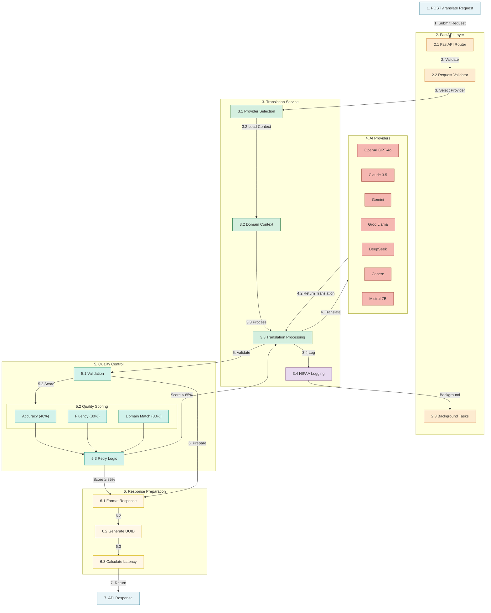

# Insurance & Healthcare Translation API

A specialized translation service for P&C Insurance and Healthcare domains using FastAPI and multiple AI providers.

## Features

### Core Capabilities

- Multi-provider AI integration with quality control
- Domain-specific expertise in Healthcare and Insurance
- Support for English, Spanish, and Chinese translations
- Advanced format preservation for complex documents
- Quality validation with detailed feedback
- HIPAA-compliant logging and processing
- Smart document chunking for handling documents of any size
- Continuation marker cleanup for seamless translations

### Supported AI Providers & Models

#### OpenAI Models

- GPT-4o (128k context, 16k output)
- GPT-4o Mini (128k context, 16k output)

#### Anthropic Models

- Claude 3.5 Sonnet (Latest version)
- Claude 3.5 Haiku (Fast and efficient)

#### Google Models

- Gemini 2.0 Flash (Latest and fastest)
- Gemini 1.5 Pro (Most capable)
- Gemini 1.5 Flash (Balanced)

#### Groq Models

- Llama 3.3 70B Versatile (8k context, 4k output)
- Llama 3.3 70B SpecDec (8k context, 4k output)

#### Additional Providers

- Cohere: Command-R Plus
- DeepSeek: DeepSeek Chat
- HuggingFace: Mistral-7B-Instruct-v0.3

### Google Vertex AI Setup

To use Google's Gemini models through Vertex AI, you need to set up the proper IAM roles for your service account. Follow these steps:

1. **Install Google Cloud SDK** (if not already installed):
   ```bash
   # For macOS with Homebrew
   brew install --cask google-cloud-sdk
   
   # Alternative: Direct installation
   curl https://sdk.cloud.google.com > install.sh && bash install.sh --disable-prompts
   ```

2. **Initialize and authenticate**:
   ```bash
   gcloud init
   gcloud auth login
   gcloud config set project YOUR_PROJECT_ID
   ```

3. **Enable the Vertex AI API**:
   ```bash
   gcloud services enable aiplatform.googleapis.com
   ```

4. **Add required IAM roles** to your service account:
   ```bash
   # Replace SERVICE_ACCOUNT_NAME and PROJECT_ID with your values
   
   # Vertex AI User role - Basic access to use Vertex AI models
   gcloud projects add-iam-policy-binding PROJECT_ID \
     --member=serviceAccount:SERVICE_ACCOUNT_NAME@PROJECT_ID.iam.gserviceaccount.com \
     --role=roles/aiplatform.user
   
   # Vertex AI Service Agent role - Allows the service account to act as a Vertex AI service agent
   gcloud projects add-iam-policy-binding PROJECT_ID \
     --member=serviceAccount:SERVICE_ACCOUNT_NAME@PROJECT_ID.iam.gserviceaccount.com \
     --role=roles/aiplatform.serviceAgent
   
   # Vertex AI Admin role - Full administrative access to Vertex AI resources
   gcloud projects add-iam-policy-binding PROJECT_ID \
     --member=serviceAccount:SERVICE_ACCOUNT_NAME@PROJECT_ID.iam.gserviceaccount.com \
     --role=roles/aiplatform.admin
   
   # Service Account User role - Allows the service account to be properly impersonated
   gcloud projects add-iam-policy-binding PROJECT_ID \
     --member=serviceAccount:SERVICE_ACCOUNT_NAME@PROJECT_ID.iam.gserviceaccount.com \
     --role=roles/iam.serviceAccountUser
   ```

5. **Verify IAM roles**:
   ```bash
   gcloud projects get-iam-policy PROJECT_ID --format=json | grep -A 10 SERVICE_ACCOUNT_NAME
   ```

These IAM roles are required to resolve the "Permission 'aiplatform.endpoints.predict' denied" error when accessing Gemini models through Vertex AI.

### Latest Improvements

#### Enhanced Document Chunking (November 2024)

The system now features an improved document chunking mechanism that:

- Intelligently handles documents of any size by breaking them into optimal chunks
- Preserves paragraph and sentence boundaries during chunking
- Processes each chunk with appropriate context for consistent translations
- Automatically detects and removes continuation markers between chunks
- Provides seamless end-to-end translations regardless of document length

#### Continuation Marker Cleanup

For large documents processed in chunks, the system now automatically:

- Detects and removes any continuation phrases or markers between chunks
- Eliminates phrases like "[Continúa la traducción...]" or "Would you like me to continue?"
- Ensures clean transitions between translated segments
- Produces a final translation that appears as a single cohesive document

These improvements eliminate issues with incomplete translations and ensure professional, seamless output for documents of any size.

### Domain Expertise

#### Healthcare Translation

- Medical terminology (ICD-10, CPT codes)
- Clinical documentation
- Pharmaceutical information
- Medical device specifications
- Clinical trial protocols
- HIPAA compliance

#### Insurance Translation

- Policy wording and coverage terms
- Claims documentation
- Underwriting guidelines
- Regulatory compliance
- Insurance contracts
- P&C insurance terminology

### Format Preservation

The API includes advanced format preservation capabilities that maintain the exact visual structure of translated documents:

#### Preserved Formatting Elements

- Bullet points and bullet lists (•, *, -, etc.)
- Nested lists with original indentation levels
- Numbered lists and alphanumeric sequences
- Tables with proper alignment and structure
- Headers and subheaders (# and ## markdown)
- Paragraph breaks and spacing
- Bold, italic, and other text styling

#### How It Works

1. Enhanced model instructions enforce strict format preservation
2. Dedicated validation evaluates formatting accuracy (20% of quality score)
3. Format-specific improvement cycles for translations below threshold
4. Cross-model consistency for reliable output across providers

#### Example Use Cases

- Medical forms with complex tables and lists
- Insurance policies with hierarchical formatting
- Regulatory documents requiring exact structural preservation
- Clinical documentation with precise formatting requirements

## System Workflow

### End-to-End System Architecture and Process Flow



## Setup

### Prerequisites

- Python 3.8 or higher
- Git
- Google Cloud SDK (for Google Vertex AI integration)

### Installation Steps

1. Clone the repository:

```bash
git clone https://github.com/yourusername/insurance-healthcare-translation-api.git
cd insurance-healthcare-translation-api
```

2. Create and activate a virtual environment:

```bash
python -m venv venv
source venv/bin/activate  # On Windows: venv\Scripts\activate
```

3. Install dependencies:

```bash
pip install -r requirements.txt
```

4. Configure environment variables:

```bash
# Copy the example environment file
cp .env.example .env

# Edit the .env file with your API keys
# Required API keys (at least one provider is needed):
# - OPENAI_API_KEY
# - ANTHROPIC_API_KEY
# - GOOGLE_API_KEY or GOOGLE_APPLICATION_CREDENTIALS (for Vertex AI)
# - GROQ_API_KEY
# - DEEPSEEK_API_KEY
# - COHERE_API_KEY
# - HF_TOKEN
```

5. For Google Vertex AI setup (if using Google Gemini models):

```bash
# Install Google Cloud SDK if not already installed
./install.sh

# Initialize and authenticate
gcloud init
gcloud auth login
gcloud config set project YOUR_PROJECT_ID

# Enable the Vertex AI API
gcloud services enable aiplatform.googleapis.com

# Set up IAM roles as described in the "Google Vertex AI Setup" section
```

6. Run the application:

```bash
# Using the run.py script
python run.py

# Or directly with uvicorn
uvicorn app.main:app --reload
```

7. Access the API documentation:

```
http://localhost:8000/docs
```

### Verifying Installation

To verify that your installation is working correctly:

1. Open your browser and navigate to `http://localhost:8000/docs`
2. Expand the GET `/health` endpoint
3. Click "Try it out" and then "Execute"
4. You should receive a 200 OK response with system health information

If you encounter any issues, refer to the "Error Handling" and "Troubleshooting" sections.

## API Documentation

### Interactive Swagger UI Documentation

The API comes with built-in interactive documentation powered by Swagger UI, available at:

```
http://localhost:8000/docs
```

Features of the Swagger UI:

- Interactive API testing interface
- Detailed schema information
- Request/response examples
- Authentication setup
- Model definitions
- Try-it-out functionality

Alternative API documentation (ReDoc) is available at:

```
http://localhost:8000/redoc
```

### OpenAPI Specification

The complete OpenAPI specification is available at:

```
http://localhost:8000/openapi.json
```

### Using Swagger UI for Testing

1. Navigate to `http://localhost:8000/docs` in your web browser
2. The Swagger UI interface will show all available endpoints
3. Click on an endpoint to expand it
4. Click the "Try it out" button
5. Fill in the required parameters:
   - For POST requests, you can use the provided JSON schema
   - For GET requests, fill in any query parameters
6. Click "Execute" to send the request
7. View the:
   - Request URL
   - Response status code
   - Response body
   - Response headers

Example using the translation endpoint:

1. Expand the POST /translate endpoint
2. Click "Try it out"
3. Use this sample request:

```json
{
    "text": "Patient shows signs of acute myocardial infarction",
    "source_language": "en",
    "target_language": "es",
    "domain": "healthcare",
    "quality_level": "high",
    "provider": "anthropic",
    "model": "claude-3-5-sonnet-20241022"
}
```

4. Click "Execute"

## Format Preservation Examples

### Using the Postman Collection

The project includes a comprehensive Postman collection (`postman_collection.json`) with examples demonstrating format preservation capabilities:

1. **Healthcare Format Test**

   - Preserves bullet points, nested lists, tables and markdown formatting
   - Maintains complex medical document structure
   - Demonstrates Claude 3.5 Sonnet's format handling capabilities
2. **Insurance Document Format Test**

   - Preserves policy structure with headers, bullets, and tables
   - Maintains exact monetary values and coverage details
   - Shows GPT-4o's capabilities for complex insurance documents

### Example Request (Complex Formatting)

```json
{
  "text": "# Patient Health Summary\n\n## Medical History\n* **Hypertension**: Diagnosed in 2018\n* **Type 2 Diabetes**: Diagnosed in 2019\n  * HbA1c: 7.2% (last checked 2023-05-15)\n  * Currently managed with Metformin 1000mg twice daily\n* **Allergies**:\n  * Penicillin - Severe rash\n  * Shellfish - Anaphylaxis\n\n## Current Medications\n| Medication | Dosage | Frequency | Purpose |\n|------------|--------|-----------|--------|\n| Lisinopril | 10mg | Once daily | Hypertension |\n| Metformin | 1000mg | Twice daily | Diabetes |\n| Aspirin | 81mg | Once daily | Cardiac prophylaxis |\n\n## Recommended Follow-up\n1. Schedule endocrinology appointment within 3 months\n2. Blood pressure monitoring weekly\n3. Complete lipid panel at next visit",
  "source_language": "en",
  "target_language": "es",
  "domain": "healthcare",
  "quality_level": "high",
  "preserve_formatting": true,
  "provider": "anthropic",
  "model": "claude-3-5-sonnet-20241022"
}
```

### Tips for Format Preservation

1. Always set `preserve_formatting: true` to maintain document structure
2. Use `quality_level: "high"` for translations requiring precise formatting
3. Consider provider selection based on format complexity:
   - Claude models excel at complex markdown
   - GPT-4o handles tables and lists exceptionally well
   - Gemini models maintain spacing and indentation effectively
4. Run format preservation tests to determine the best model for your specific formatting needs

## Testing Framework

The API includes a comprehensive testing framework for validating format preservation across different models and scenarios:

### Format Preservation Tests

- Tests all providers and models with various formatting elements
- Validates format preservation across all language pairs
- Compares performance across different domains
- Verifies the impact of the `preserve_formatting` flag

### Running the Tests

```bash
# Install test dependencies
pip install -r requirements.txt

# Run the full test suite
python test_format_preservation.py

# Run specific test cases
pytest -xvs test_format_preservation.py::test_all_formats_all_models
```

### Test Scenarios

1. **Format Types**: Bullet lists, numbered lists, tables, and mixed formatting
2. **Language Pairs**: All supported language combinations
3. **Domains**: Healthcare and insurance-specific formatting
4. **Quality Levels**: Performance across different quality settings

### Validation Criteria

The tests validate exact preservation of:

- Line count (with minimal tolerance)
- Bullet point and list formatting
- Numbered list structure
- Table rows and alignment
- Headers and subheaders
- Text styling (bold, italic)

Detailed results are saved to JSON files for analysis and performance tracking.

## System Endpoints

#### GET /supported-languages

Returns available language pairs

#### GET /supported-providers

Returns available providers and models

#### GET /health

Returns system health status and metrics

## Quality Control

### Translation Validation

- Accuracy scoring (35%)

  - Terminology precision
  - Numerical value preservation
  - Abbreviation handling
- Fluency assessment (25%)

  - Natural language flow
  - Domain-appropriate register
  - Grammar and syntax
- Format Preservation (20%)

  - List and bullet point preservation
  - Table structure maintenance
  - Spacing and indentation retention
  - Special formatting elements
- Domain Compliance (20%)

  - Industry standards adherence
  - Regulatory terminology
  - Contextual appropriateness

### Quality Levels

- High: Full validation with detailed feedback
- Medium: Basic validation
- Draft: Quick translation without validation

## Security & Compliance

- Secure API key management
- Input validation and sanitization
- HIPAA-compliant logging
- Rate limiting and error handling
- No sensitive data storage
- Request/response encryption
- Audit trail maintenance

## Error Handling

- Invalid language pair detection
- Domain validation
- Model availability checks
- Rate limit monitoring
- API key validation
- Comprehensive error messages

### Troubleshooting Google Vertex AI

If you encounter the following error when using Google Gemini models:

```
Permission 'aiplatform.endpoints.predict' denied on resource '//aiplatform.googleapis.com/projects/PROJECT_ID/locations/LOCATION/publishers/google/models/MODEL_NAME'
```

This indicates an IAM permission issue. Follow these steps to resolve it:

1. **Check that your service account has the necessary IAM roles** as described in the "Google Vertex AI Setup" section.

2. **Verify API enablement**:
   ```bash
   gcloud services list --enabled | grep aiplatform
   ```
   If not listed, enable it with: `gcloud services enable aiplatform.googleapis.com`

3. **Check model availability** in your region:
   ```bash
   gcloud ai models list --region=REGION
   ```

4. **Verify billing status** for your Google Cloud project.

5. **Consider using application-default credentials** if running locally:
   ```bash
   gcloud auth application-default login
   ```

6. **Check for account type restrictions**: Some Gemini model features require a monthly invoiced billing account.

7. **Alternative approach**: If Vertex AI issues persist, consider using the Google AI Python SDK directly:
   ```bash
   pip install google-generativeai
   ```

## Support

For technical support or feature requests:

1. Open a GitHub issue
2. Email: support@example.com
3. Check API documentation at /docs endpoint

## License

MIT License - See LICENSE file for details
